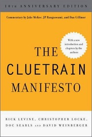
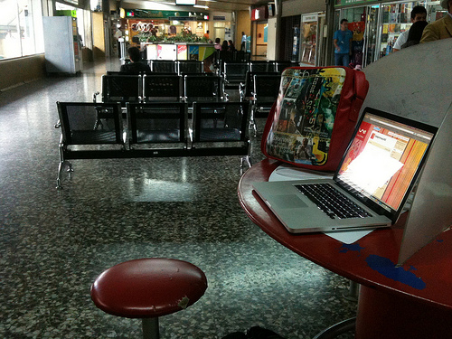
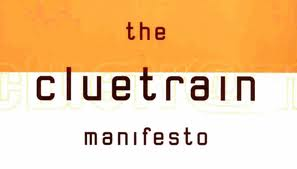

<!SLIDE bullets incremental transition=fade>
# The Cluetrain Manifesto #
* 

<!SLIDE bullets incremental transition=fade>
#In the beggining there was...
* 

<!SLIDE bullets incremental transition=fade>
* And a Revolution began... 

<!SLIDE bullets incremental transition=fade>
* 95 theses 
* Show-off forked by Dominique De Leon

<!SLIDE bullets incremental transition=fade>
#95 what?
* TCM is a set of 95 theses organized and put forward as a manifesto, or call to action, for all businesses operating within what is suggested to be a newly-connected marketplace. [WIKI]

<!SLIDE bullets incremental transition=shuffle>
#Ready for thesis 1? 
* Here it goes... 

<!SLIDE bullets incremental transition=toss>
# Markets are #
* conversations. 

<!SLIDE bullets incremental transition=scrollDown>
# Markets consist of human beings,   
* not demographic sectors. 

<!SLIDE bullets incremental transition=scrollDown>
# Conversations among human beings sound human. 
* They are conducted in a human voice.

<!SLIDE bullets incremental transition=scrollDown>
# Whether delivering information, opinions, perspectives, dissenting arguments or humorous asides,
*  the human voice is typically open, natural, uncontrived. 

<!SLIDE bullets incremental transition=shuffle>
# People recognize each other
*  as such from the sound of this voice. 

<!SLIDE bullets incremental transition=toss>
# The Internet is enabling conversations among human beings 
* that were simply not possible in the era of mass media. 

<!SLIDE bullets incremental transition=scrollDown>
# Hyperlinks
* subvert hierarchy. 

<!SLIDE bullets incremental transition=scrollDown>
# In both internetworked markets and among intranetworked employees, people are speaking to each other
* in a powerful new way. 

<!SLIDE bullets incremental transition=scrollDown>
# These networked conversations are enabling powerful new forms of social organization and knowledge exchange
* to emerge. 

<!SLIDE bullets incremental transition=shuffle>
# As a result, markets are getting smarter, more informed, more organized.
* Participation in a networked market changes people fundamentally. 

<!SLIDE bullets incremental transition=toss>
# People in networked markets have figured out that they get far better information and support from one another than from vendors.
* So much for corporate rhetoric about adding value to commoditized products. 

<!SLIDE bullets incremental transition=fade>
* 

<!SLIDE bullets incremental transition=scrollDown>
# There are no secrets. The networked market knows more than companies do about their own products.
* And whether the news is good or bad, they tell everyone.  

<!SLIDE bullets incremental transition=scrollDown>
# What's happening to markets is also happening among employees.
* A metaphysical construct called "The Company" is the only thing standing between the two.  

<!SLIDE bullets incremental transition=scrollDown>
# Corporations do not speak in the same voice as these new networked conversations.
* To their intended online audiences, companies sound hollow, flat, literally inhuman.  

<!SLIDE bullets incremental transition=scrollUp>
# In just a few more years, the current homogenized  voice of business—the sound of mission statements
* and brochures—will seem as contrived and artificial as the language of the 18th century French court.

<!SLIDE bullets incremental transition=scrollDown>
# Already, companies that speak in the language of the pitch,
* the dog-and-pony show, are no longer speaking to anyone.  

<!SLIDE bullets incremental transition=scrollDown>
# Companies that assume online markets are the same markets that used to watch their ads on television are kidding
* themselves.   

<!SLIDE bullets incremental transition=scrollDown>
# Companies that don't realize their markets are now networked person-to-person, getting smarter as a result
* and deeply joined in conversation are missing their best opportunity. 

<!SLIDE bullets incremental transition=scrollDown>
# Companies can now communicate with their markets directly.
* If they blow it, it could be their last chance. 

<!SLIDE bullets incremental transition=shuffle>
# Companies need to realize their markets are often laughing.
* At them. 

<!SLIDE bullets incremental transition=toss>
# Companies need to lighten up and take themselves less seriously.
* They need to get a sense of humor.

<!SLIDE bullets incremental transition=scrollDown>
# Getting a sense of humor does not mean putting some jokes on the corporate web site. 
* Rather, it requires big values, a little humility, straight talk, and a genuine point of view.

<!SLIDE bullets incremental transition=scrollDown>
# Companies attempting to "position" themselves need to take a position.
* Optimally, it should relate to something their market actually cares about.

<!SLIDE bullets incremental transition=scrollDown>
# Bombastic boasts—
* "We are positioned to become the preeminent provider of XYZ"
* —do not constitute a position.

<!SLIDE bullets incremental transition=shuffle>
# Companies need to come down from their Ivory Towers
* and talk to the people with whom they hope to create relationships.

<!SLIDE bullets incremental transition=toss>
# Public Relations does not relate to the public.
* Companies are deeply afraid of their markets.

<!SLIDE bullets incremental transition=scrollDown>
# By speaking in language that is distant, uninviting, arrogant,
* they build walls to keep markets at bay.

<!SLIDE bullets incremental transition=scrollDown>
# Most marketing programs are based on the fear that the market might see what's really going on
* inside the company.

<!SLIDE bullets incremental transition=scrollDown>
# Elvis said it best
* "We can't go on together with suspicious minds."

<!SLIDE bullets incremental transition=shuffle>
# Brand loyalty is the corporate version of going steady, but the breakup is inevitable—and coming fast.
* Because they are networked, smart markets are able to renegotiate relationships with blinding speed.

<!SLIDE bullets incremental transition=toss>
# Networked markets can change suppliers overnight.
* Networked knowledge workers can change employers over lunch. Your own "downsizing initiatives" taught us to ask the question
* "Loyalty? What's that?"

<!SLIDE bullets incremental transition=scrollDown>
# Smart markets will find suppliers who speak
* their own language.

<!SLIDE bullets incremental transition=scrollDown>
# Learning to speak with a human voice is not a parlor trick.
* It can't be "picked up" at some tony conference.

<!SLIDE bullets incremental transition=scrollDown>
# To speak with a human voice, companies must share
* the concerns of their communities.

<!SLIDE bullets incremental transition=shuffle>
# But first, they must belong
* to a community.

<!SLIDE bullets incremental transition=toss>
# Companies must ask themselves
* where their corporate cultures end.

<!SLIDE bullets incremental transition=scrollDown>
# If their cultures end before the community begins,
* they will have no market.

<!SLIDE bullets incremental transition=scrollDown>
# Human communities are based on discourse
* on human speech about human concerns.

<!SLIDE bullets incremental transition=scrollDown>
# The community of discourse
* is the market.

<!SLIDE bullets incremental transition=shuffle>
# Companies that do not belong to a community of discourse
* will die.

<!SLIDE bullets incremental transition=toss>
# Companies make a religion of security, but this is largely a red herring.
* Most are protecting less against competitors than against their own market and workforce.

<!SLIDE bullets incremental transition=scrollDown>
# As with networked markets, people are also talking to each other directly inside the company—and not just about rules and regulations, boardroom directives, bottom lines.

<!SLIDE bullets incremental transition=scrollDown>
# Such conversations are taking place today on corporate intranets.
* But only when the conditions are right.

<!SLIDE bullets incremental transition=scrollDown>
# Companies typically install intranets top-down to distribute HR policies and other corporate information that workers are doing their best to ignore.

<!SLIDE bullets incremental transition=shuffle>
# Intranets naturally tend to route around boredom.
* The best are built bottom-up by engaged individuals cooperating to construct something far more valuable: an intranetworked corporate conversation.

<!SLIDE bullets incremental transition=toss>
# A healthy intranet organizes workers in many meanings of the word. 
* Its effect is more radical than the agenda of any union.

<!SLIDE bullets incremental transition=scrollDown>
# While this scares companies witless, they also depend heavily on open intranets to generate and share critical knowledge.
* They need to resist the urge to "improve" or control these networked conversations.

<!SLIDE bullets incremental transition=scrollDown>
# When corporate intranets are not constrained by fear and legalistic rules,
* the type of conversation they encourage sounds remarkably like the conversation of the networked marketplace.

<!SLIDE bullets incremental transition=scrollDown>
# Org charts worked in an older economy where plans could be fully understood from atop steep management pyramids
* and detailed work orders could be handed down from on high.

<!SLIDE bullets incremental transition=shuffle>
# Today, the org chart is hyperlinked, not hierarchical.
* Respect for hands-on knowledge wins over respect for abstract authority.

<!SLIDE bullets incremental transition=toss>
# Command-and-control management styles both derive from and reinforce bureaucracy
* power tripping and an overall culture of paranoia.

<!SLIDE bullets incremental transition=scrollDown>
# Paranoia kills conversation.
* That's its point.
* But lack of open conversation kills companies.

<!SLIDE bullets incremental transition=scrollDown>
# There are two conversations going on. 
* One inside the company.
* One with the market.

<!SLIDE bullets incremental transition=fade>
* 

<!SLIDE bullets incremental transition=scrollDown>
# In most cases, neither conversation is going very well. Almost invariably, the cause of failure can be traced
* to obsolete notions of command and control.

<!SLIDE bullets incremental transition=shuffle>
# As policy, these notions are poisonous. As tools, they are broken.
* Command and control are met with hostility by intranetworked knowledge workers and generate distrust in internetworked markets.

<!SLIDE bullets incremental transition=toss>
# These two conversations want to talk to each other.
* They are speaking the same language.
* They recognize each other's voices.

<!SLIDE bullets incremental transition=scrollDown>
# Smart companies will get out of the way and help the inevitable to happen sooner.

<!SLIDE bullets incremental transition=scrollDown>
# If willingness to get out of the way is taken as a measure of IQ,
* then very few companies have yet wised up.

<!SLIDE bullets incremental transition=scrollDown>
# However subliminally at the moment, millions of people now online perceive companies as little more than quaint legal fictions
* that are actively preventing these conversations
* from intersecting.

<!SLIDE bullets incremental transition=shuffle>
# This is suicidal.
* Markets want to talk to companies.

<!SLIDE bullets incremental transition=toss>
# Sadly, the part of the company a networked market wants to talk to is usually hidden behind a smokescreen of hucksterism,
* of language that rings false—and often is.

<!SLIDE bullets incremental transition=scrollDown>
# Markets do not want to talk to flacks and hucksters.
* They want to participate in the conversations going on behind the corporate firewall.

<!SLIDE bullets incremental transition=scrollDown>
# De-cloaking, getting personal:
* We are those markets. We want to talk to you.

<!SLIDE bullets incremental transition=scrollDown>
# We want access to your corporate information,
* to your plans and strategies,
* your best thinking, your genuine knowledge.
* We will not settle for the 4-color brochure, for web sites chock-a-block with eye candy but lacking any substance.

<!SLIDE bullets incremental transition=shuffle>
# We're also the workers who make your companies go. We want to talk to customers directly in our own voices,
* not in platitudes written into a script.

<!SLIDE bullets incremental transition=toss>
# As markets, as workers, both of us are sick to death of getting our information by remote control.
* Why do we need faceless annual reports and third-hand market research studies to introduce us to each other?

<!SLIDE bullets incremental transition=scrollDown>
# As markets, as workers, we wonder why you're not listening.
* You seem to be speaking a different language.

<!SLIDE bullets incremental transition=scrollDown>
# The inflated self-important jargon you sling around—in the press
* at your conferences—what's that got to do with us?

<!SLIDE bullets incremental transition=shuffle>
# Maybe you're impressing your investors.
* Maybe you're impressing Wall Street.
* You're not impressing us.

<!SLIDE bullets incremental transition=scrollDown>
# If you don't impress us, your investors are going to take a bath.
* Don't they understand this? If they did, they wouldn't let you talk that way.

<!SLIDE bullets incremental transition=scrollDown>
# Your tired notions of "the market" make our eyes glaze over.
* We don't recognize ourselves in your projections—perhaps because we know we're already elsewhere.

<!SLIDE bullets incremental transition=scrollDown>
# We like this new marketplace much better.
* In fact, we are creating it.

<!SLIDE bullets incremental transition=scrollDown>
# You're invited, but it's our world. Take your shoes off at the door.
* If you want to barter with us, get down off that camel!

<!SLIDE bullets incremental transition=shuffle>
# We are immune to advertising.
* Just forget it.

<!SLIDE bullets incremental transition=toss>
# If you want us to talk to you, tell us something.
* Make it something interesting for a change.

<!SLIDE bullets incremental transition=scrollDown>
# We've got some ideas for you too: some new tools we need, some better service.
* Stuff we'd be willing to pay for. Got a minute?

<!SLIDE bullets incremental transition=scrollDown>
# You're too busy "doing business" to answer our email?
* Oh gosh, sorry, gee, we'll come back later.
* Maybe.

<!SLIDE bullets incremental transition=scrollDown>
# You want us to pay? 
* We want you to pay attention.

<!SLIDE bullets incremental transition=shuffle>
# We want you to drop your trip, come out of your neurotic self-involvement
* join the party.

<!SLIDE bullets incremental transition=toss>
# Don't worry, you can still make money.
* That is, as long as it's not the only thing on your mind.

<!SLIDE bullets incremental transition=fade>
* 

<!SLIDE bullets incremental transition=scrollDown>
# Have you noticed that, in itself, money is kind of one-dimensional and boring?
* What else can we talk about?

<!SLIDE bullets incremental transition=scrollDown>
# Your product broke. Why? We'd like to ask the guy who made it. Your corporate strategy makes no sense. We'd like to have a chat with your CEO.
* What do you mean she's not in?

<!SLIDE bullets incremental transition=scrollDown>
# We want you to take 50 million of us as seriously
* as you take one reporter from The Wall Street Journal.

<!SLIDE bullets incremental transition=shuffle>
# We know some people from your company. They're pretty cool online.
* Do you have any more like that you're hiding?
* Can they come out and play?

<!SLIDE bullets incremental transition=toss>
# When we have questions we turn to each other for answers.
* If you didn't have such a tight rein on "your people" maybe they'd be among the people we'd turn to.

<!SLIDE bullets incremental transition=scrollDown>
# When we're not busy being your "target market," many of us are your people. We'd rather be talking to friends online than watching the clock.
* That would get your name around better than your entire million dollar web site.
* But you tell us speaking to the market is Marketing's job.

<!SLIDE bullets incremental transition=scrollDown>
# We'd like it if you got what's going on here. That'd be real nice.
* But it would be a big mistake to think we're holding our breath.

<!SLIDE bullets incremental transition=scrollDown>
# We have better things to do than worry about whether you'll change in time to get our business.
* Business is only a part of our lives. It seems to be all of yours.
* Think about it: who needs whom?

<!SLIDE bullets incremental transition=shuffle>
# We have real power and we know it. If you don't quite see the light, some other outfit will come along that's more attentive, more interesting, more fun to play with.

<!SLIDE bullets incremental transition=toss>
# Even at its worst, our newfound conversation is more interesting than most trade shows, more entertaining than any TV sitcom, and certainly more true-to-life than the corporate web sites we've been seeing.

<!SLIDE bullets incremental transition=scrollDown>
# Our allegiance is to ourselves—our friends, our new allies and acquaintances, even our sparring partners.
* Companies that have no part in this world, also have no future.

<!SLIDE bullets incremental transition=scrollDown>
# Companies are spending billions of dollars on Y2K.
* Why can't they hear this market timebomb ticking?
* The stakes are even higher.

<!SLIDE bullets incremental transition=scrollDown>
# We're both inside companies and outside them. The boundaries that separate our conversations look like the Berlin Wall today, 
* but they're really just an annoyance. We know they're coming down. We're going to work from both sides to take them down.

<!SLIDE bullets incremental transition=shuffle>
# To traditional corporations, networked conversations may appear confused, may sound confusing. But we are organizing faster than they are.
* We have better tools
* more new ideas
* no rules to slow us down.

<!SLIDE bullets incremental transition=toss>
# We are waking up and linking to each other.  
* We are watching. 
* But we are not waiting.

<!SLIDE bullets incremental transition=scrollUp>
# That's the 95 theses by 

<!SLIDE bullets incremental transition=scrollUp>
# 
# The end

<!SLIDE bullets incremental transition=fade>
# of Business

<!SLIDE bullets incremental transition=fade>
# as usual

<!SLIDE bullets incremental transition=scrollUp>
# The Cluetrain Manifesto Effect
* a Vertical Market Solutions Reader
* by Dominique De Leon is available for download  at http://bit.ly/thecluetrainmanifestoeffect
 
<!SLIDE bullets incremental transition=scrollUp>
# Photo Credits
* Flickr Creative Commons licensed photos by
 aubergene, US Mission Geneva, epSos.de, Mario Carvajal, jared

<!SLIDE bullets incremental transition=scrollUp>
* Vertsol homework 1T 2011
* Submitted to Sir Paul Pajo 

<!SLIDE bullets incremental transition=scrollUp>
* 
* This work is licensed under a Creative Commons Attribution-Noncommercial-Share Alike 3.0 Philippines License.